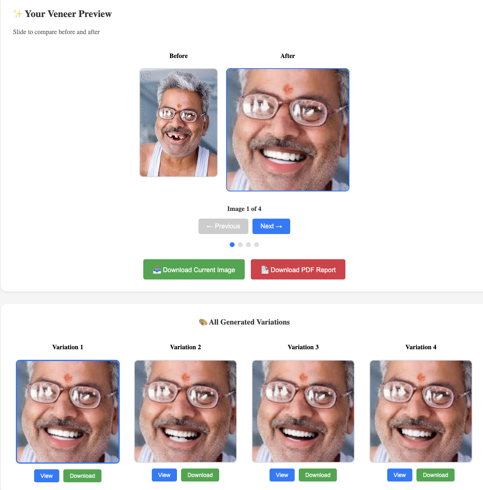

# 🦷 VeneerVision AI
# Note: AWS Placeholder files present, code content hidden to prevent plagiarism

# Web app Link: https://veneer-vision-app.vercel.app/





**VeneerVision AI** is a full-stack web application that uses AI to simulate dental veneers on smile images. Built with a React frontend and Express backend, powered by the Replicate API, it enables users to upload or capture a smile photo, select veneer shades, and view AI-generated previews. Designed for both patients and dentists, it features a quiz, lead capture, PDF reports, and a "Dentist Mode" for advanced simulations.

---

## 🚀 Features
- **AI-Powered Veneer Simulation** (Replicate API: `sourav-sarkar-doc32/smile-correct`)
- **Multiple Image Generation** (Dentist Mode: up to 4 variations)
- **Smile Style Quiz** for personalized recommendations
- **Drag & Drop Upload** and **Camera Capture**
- **PDF Report Generation**
- **Lead Capture** (with dentist info option)
- **Downloadable Results**
- **Modern, Responsive UI**

---

## 🏃‍♂️ How to Run Locally

### 1. Clone the Repository
```bash
git clone https://github.com/varundataquest/VeneerApp.git
cd VeneerApp
```

### 2. Install Dependencies
```bash
cd backend && npm install
cd ../frontend && npm install
```

### 3. Set Up Environment Variables
- Copy `.env.example` to `.env` in `backend/` and add your Replicate API key:
```
REPLICATE_API_TOKEN=your_replicate_api_token
```

### 4. Start the App
- In one terminal:
```bash
cd backend && npm start
```
- In another terminal:
```bash
cd frontend && npm start
```
- Visit [http://localhost:3000](http://localhost:3000)

---

## 🌥️ About the `cloud` Branch
This branch contains all code and configuration for cloud deployment, including:
- Cloud-ready `.gitignore` and environment setup
- Modular backend/frontend structure
- Scripts and documentation for AWS deployment

---

## ☁️ AWS Cloud Integration
Deployed VeneerVision AI as a scalable, production-grade cloud application using AWS services.

### 1. **Frontend Hosting**
- **Amazon S3 + CloudFront**: Hosted the React build as a static website with global CDN.
- **Steps:**
  - Built frontend: `cd frontend && npm run build`
  - Uploaded `frontend/build/` to an S3 bucket
  - Set up S3 static website hosting
  - Configured CloudFront for HTTPS and caching

### 2. **Backend/API Hosting**
- **AWS Elastic Beanstalk** (Node.js environment) or **AWS Lambda + API Gateway**
- **Elastic Beanstalk Steps:**
  - Zipped the `backend/` folder (with `package.json`)
  - Deployed via AWS Console
  - Set environment variables (API keys, etc)
- **Lambda Steps (Serverless):**
  - Refactored Express routes as Lambda handlers
  - Used AWS API Gateway to expose endpoints
  - Stored secrets in AWS Secrets Manager 

### 3. **File Storage**
- **Amazon S3**: Stored uploaded images and generated results
- Updated backend to upload/download files from S3

### 4. **CI/CD Pipeline**
- **GitHub Actions**: Automated build, test, and deploy to AWS (Elastic Beanstalk, S3, Lambda)
- Example: On push to `cloud` branch, trigger deployment jobs

### 5. **Monitoring & Security**
- **AWS CloudWatch**: Monitored logs and metrics
- **IAM Roles/Policies**: Secured access to S3, Lambda, etc
- **HTTPS**: Enforced via CloudFront and API Gateway

---

## 🤝 Contributing
Pull requests welcome! For major changes, open an issue first to discuss what you'd like to change.

---

## 📄 License
MIT

---

## 💡 Inspiration
This project demonstrates modern cloud-native app development, AI integration, and best practices for scalable deployment.

---

**Questions?** Open an issue or contact [varundataquest](https://github.com/varundataquest) on GitHub.
